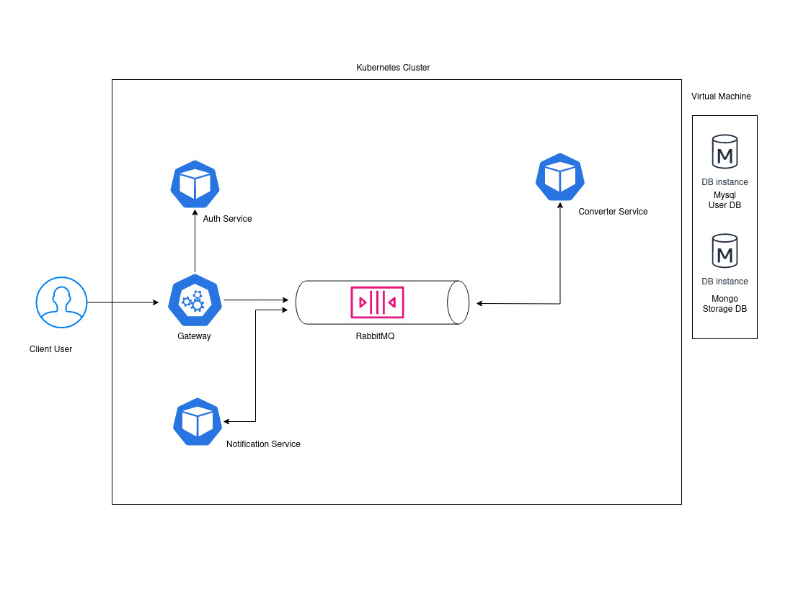

# DSP Project - Distributed Systems using Python

## Overview
This project is created as a learning initiative for Devops tools and mainly python.

## Technologies used
- Ansible
- Vagrant(Virtualbox)
- MySQL
- MongoDB
- Flask
- RabbitMQ
- Minikube

## Architechture

